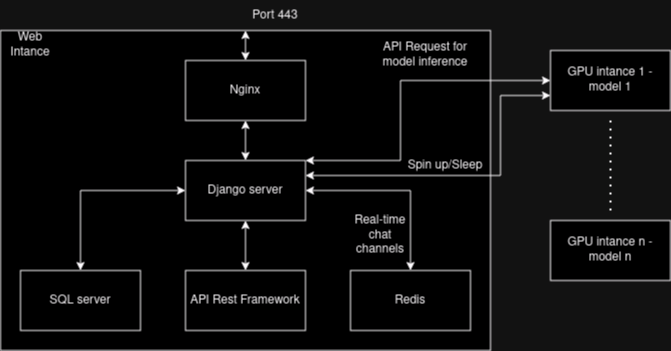

django-inference-portal
=======================

This is a simple dynamic django server that use django channels to interact with GPU servers for language model inference.

Purpose
-------

The purpose of this project is to offers users simple interfaces to interact with GPU servers.
This website processses API and HTTP requests from users, forwards them to the GPU servers and forward the responses back in a dynamic manner.
This website also use STRIPE to process users' payment

Design
-------

Explain:
- Redis server fowards the message for the websockets that are used for real time chat.
- SQL stores API key and model metadata using the default SQLlite shipped with Django. 
- API Rest Framework open endpoints for the webportal, the webportal then forward the user requests to GPU servers.
- GPU servers do inference, each GPU server holds one model and uses vLLM to open endpoints. 
- Nginx is used as a proxy for the Django server and serve static files.
- Django server runing Daphne or Gurnicorn + Daphne.

Installation
--------------

First of all for start using django-inference-poratal you must download it using git

    git clone https://github.com/Drzhivago264/Inference_Portal.git

Next you must install dependencies:

    pip install -r "requirements.txt"

Next you must install Redis and start Redis Server at port 6380:

    sudo apt install lsb-release curl gpg
    curl -fsSL https://packages.redis.io/gpg | sudo gpg --dearmor -o /usr/share/keyrings/redis-archive-keyring.gpg
    echo "deb [signed-by=/usr/share/keyrings/redis-archive-keyring.gpg] https://packages.redis.io/deb $(lsb_release -cs) main" | sudo tee /etc/apt/sources.list.d/redis.list
    sudo apt-get update
    sudo apt-get install redis
    redis-server --port 6380

Next you must setup STRIPE CLI and start a webhook:

    curl -s https://packages.stripe.dev/api/security/keypair/stripe-cli-gpg/public | gpg --dearmor | sudo tee /usr/share/keyrings/stripe.gpg
    echo "deb [signed-by=/usr/share/keyrings/stripe.gpg] https://packages.stripe.dev/stripe-cli-debian-local stable main" | sudo tee -a /etc/apt/sources.list.d/stripe list
    sudo apt update
    sudo apt install stripe
    stripe listen --forward-to localhost:8000/webhooks/stripe/

Next you need to set up .env file and setup the following key:

    STRIPE_PUBLISHABLE_KEY=""
    STRIPE_SECRET_KEY=""
    BACKEND_DOMAIN=""
    PAYMENT_SUCCESS_URL=""
    PAYMENT_CANCEL_URL=""
    STRIPE_WEBHOOK_SECRET="" 
    EMAIL_ADDRESS = "" (The EMAIL_ADDRESS that fowards contact form)
    MAIL = "" (The password for EMAIL_ADDRESS that fowards contact form)

Finally you can test the server with:

    python manage.py runserver

In production environment, you may want to configure the server to be served by Daphne or both Daphne and Gurnicorn (refer to https://channels.readthedocs.io/en/1.x/deploying.html?highlight=django).

Contents in `static` directory are served as `/static/`. In production environment this folder need to be removed from root and serve by NGINX or APACHE

Final words
-----------

This project is in testing stage but feel free to test it and if you have any suggestions you can tell me.
