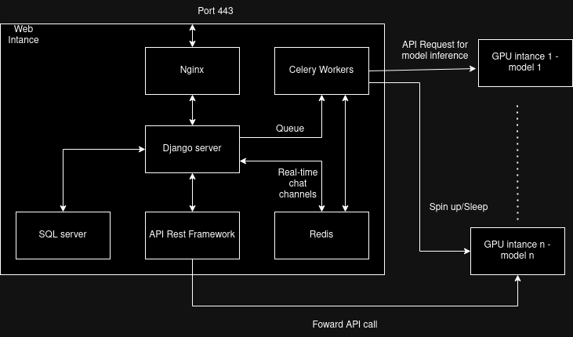

django-inference-portal
=======================

This is a simple dynamic django server that uses django channels, celery and Redis to interact with GPU servers for language model inference.

Purpose
-------

The purpose of this project is to offer users simple interfaces to interact with GPU servers.
This website processses API and HTTP requests from users, forwards them to the GPU servers and forwards the responses back in a dynamic manner, this includes real-time chat rooms. This website also uses STRIPE to process users' payment.

Design
-------

Explain:
- Redis server fowards the message for the websockets that are used for real time chat.
- SQL stores API key and model metadata using the default SQLlite shipped with Django. 
- API Rest Framework opens endpoints for the webportal, the webportal then forward the user requests to GPU servers.
- GPU servers do inference, each GPU server holds one model and uses vLLM to open endpoints. 
- Nginx is used as a proxy for the Django server and serve static files.
- Celery is used to run multiple background tasks including spin up, stop, create and terminate EC GPU instances. Celery is also used to queue 
 API requests to GPU servers.
- Django server are used to connect all components.

Installation
--------------

First of all, for start using django-inference-poratal, you must download it using git

    git clone https://github.com/Drzhivago264/Inference_Portal.git

Next you must install dependencies:

    pip install -r "requirements.txt"

Next you must install Redis and start Redis Server at port 6380:

    sudo apt install lsb-release curl gpg
    curl -fsSL https://packages.redis.io/gpg | sudo gpg --dearmor -o /usr/share/keyrings/redis-archive-keyring.gpg
    echo "deb [signed-by=/usr/share/keyrings/redis-archive-keyring.gpg] https://packages.redis.io/deb $(lsb_release -cs) main" | sudo tee /etc/apt/sources.list.d/redis.list
    sudo apt-get update
    sudo apt-get install redis
    redis-server --port 6380

Next you must install celery with redis support and launch a Celery Worker:

    pip install celery[redis]
    celery -A inferenceportal worker --loglevel=info

Next you must setup STRIPE CLI and start a webhook:

    curl -s https://packages.stripe.dev/api/security/keypair/stripe-cli-gpg/public | gpg --dearmor | sudo tee /usr/share/keyrings/stripe.gpg
    echo "deb [signed-by=/usr/share/keyrings/stripe.gpg] https://packages.stripe.dev/stripe-cli-debian-local stable main" | sudo tee -a /etc/apt/sources.list.d/stripe list
    sudo apt update
    sudo apt install stripe
    stripe listen --forward-to localhost:8000/webhooks/stripe/

Next you need to set up .env file and setup the following key:

    STRIPE_PUBLISHABLE_KEY=""
    STRIPE_SECRET_KEY=""
    BACKEND_DOMAIN=""
    PAYMENT_SUCCESS_URL=""
    PAYMENT_CANCEL_URL=""
    STRIPE_WEBHOOK_SECRET="" 
    EMAIL_ADDRESS = "" (The EMAIL_ADDRESS that fowards contact form)
    MAIL = "" (The password for EMAIL_ADDRESS that fowards contact form)
    DJANGO_SETTINGS_MODULE="inferenceportal.settings"
    aws_access_key_id="" (The AWS key that can perform boot/stop/reboot/terminiate operation on your GPU instances)
    aws_secret_access_key="" (The AWS secret key that can perform boot/stop/reboot/terminiate operation on your GPU instances)

Finally you can test the server with:

    python manage.py runserver

In production environment, you may want to configure the server to be served by Daphne or both Daphne and Gurnicorn (refer to https://channels.readthedocs.io/en/1.x/deploying.html?highlight=django).

Contents in `staticfiles` directory are served as `/static/`. In production environment this folder need to be removed from root and served by NGINX or APACHE

About the GPU intances, you need to set up a vLLM server to serve the models listed in LLM.model:

    # Install vLLM with CUDA 12.1.
    pip install vllm
    python -m vllm.entrypoints.openai.api_server --model {model name}

If you expose this instance to the internet you may need Nginx or Apache server in front of it. If you route it through your subnet or have a security policy that only accept requests from your Django server then you are good to go.

In addition, as we need to automatically boot and shutdown your GPU intances, you may consider using Supervisor or equivalent to setup the vLLM on startup.

Development environment setup
-----------------------------
After finishing the steps above, you need to set up a vLLM server to serve the models listed in LLM.model:

    pip install vllm
    python -m vllm.entrypoints.openai.api_server --model {model name}

You need to run a vLLM server to serve the a model (remember to avoid 8000 and 6380 port that Django is running):

    python" -m vllm.entrypoints.api_server --model gpt2 --port 8080

If you have more than 1 GPU, you can serve multiple models at multiple ports (remember of use unique ports):

    CUDA_VISIBLE_DEVICES= 1 python -m vllm.entrypoints.api_server --model gpt2 --port 8080
    CUDA_VISIBLE_DEVICES= 2 python -m vllm.entrypoints.api_server --model gpt2-large --port 8888  

If you have issue, you may need to seperate vLLM into multiple local environments.

Final words
-----------

This project is in testing stage but feel free to test it and if you have any suggestions you can tell me.
