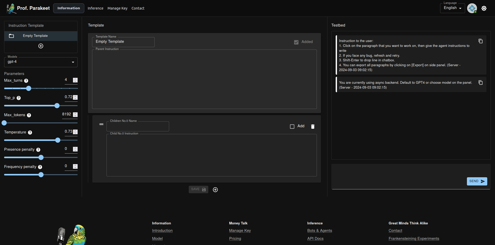
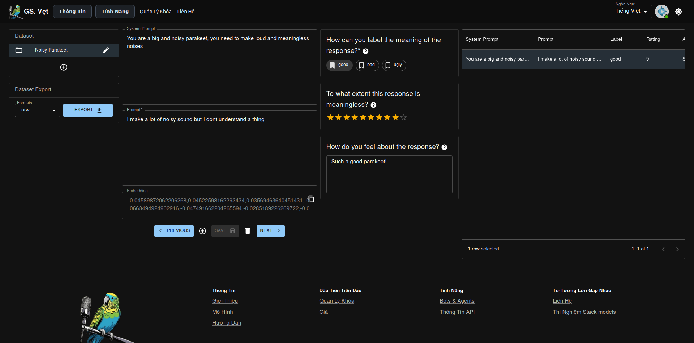
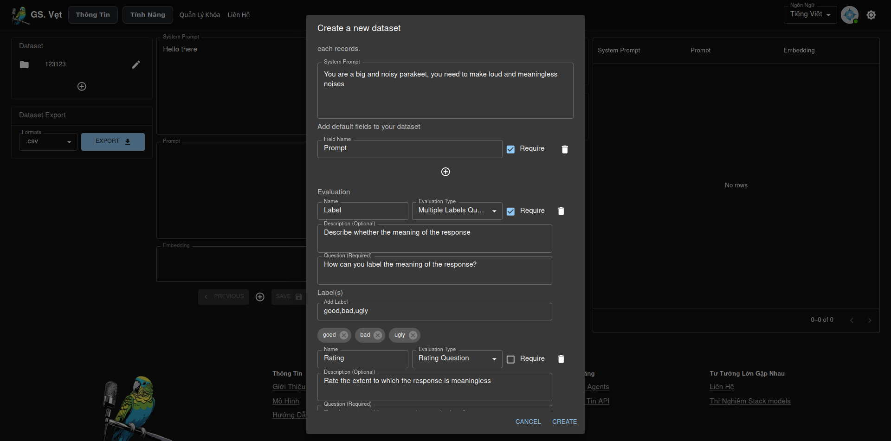
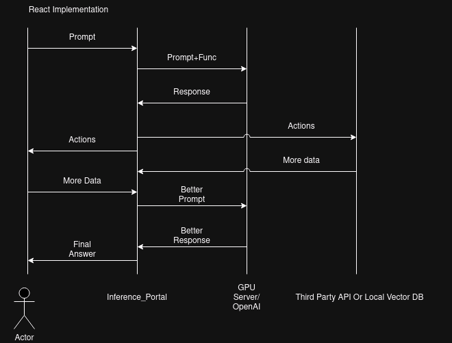

# django-inference-portal

This is a simple dynamic django server that uses django channels, django ninja, celery, vectordb and Redis to interact with GPU servers for language model inference.

## Purpose

The purpose of this project is to offer users simple interfaces to interact with GPU servers.
This website processses API and HTTP requests from users, forwards them to the GPU servers and forwards the responses back in a dynamic manner, this includes real-time chat rooms. In addition, this website also provides an implementation of REACT agent (refer to [Yao et al., 2022](https://arxiv.org/abs/2210.03629)).

## Features

Here are some features of this website:

**Agent & ChatBot:**

**Agent Building**

**Access Tokens Management:**

**Constances Configuration:**

**Data Synthesis:**

**Dataset Creation:**

**Serverside Log Render:**

**Consumption Monitoring:**

## Design

-   The /frontend of this website uses React.js which are packed into bundle in frontend/templates/frontend_index.html using webpack.
-   The backend of this website can be found in /server which use Django Rest Framework to serve requests from the frontend.
-   Redis server fowards the message for the websockets that are used for real time chat.
-   Django Channel with async customers (can be found in /server/consumers) are used to serve real-time chat messages.
-   The chat and prompt history of user is vectorised and stored for vector search.
-   Django Ninja open REST api endpoints forward the user requests to GPU servers. 
-   GPU servers do inference, each GPU server holds one model and uses vLLM to open endpoints.
-   Nginx is used as a proxy for the Django server and serve static files.
-   Celery is used to run multiple background tasks including spin up, stop, create and terminate EC GPU instances. Celery is also used to queue
    API requests to GPU servers. Noting that Celery does not run properly on Window, so you should switch to Linux or living with with --solo pool.
-   Postgresql runs locally and can only be accessed from Django

Django Ninja handles inference requests while DRF handles frontend requests. The reason behind this tech choice is because DRF is old school and intergrates very nicely with Django while Django Ninja is newer that offer better Async support. However, Ninja is much like a messy Flask App pluged into Django; therefore this tech selection make the most out of both solutions.

The implementation of React and data flow is explained in the diagram below

  

## Installation

First of all, for start using django-inference-portal, you must download it using git (Multiple old files are removed from the history so now git clone will be fast, sorry for my previous ignorance of git history)

    git clone https://github.com/Drzhivago264/Inference_Portal.git

Before install dependencies, you need to install Postgres, and create a table named professorparakeet.

    sudo sh -c 'echo "deb http://apt.postgresql.org/pub/repos/apt $(lsb_release -cs)-pgdg main" > /etc/apt/sources.list.d/pgdg.list'
    curl -fsSL https://www.postgresql.org/media/keys/ACCC4CF8.asc | sudo gpg --dearmor -o /etc/apt/trusted.gpg.d/postgresql.gpg
    sudo apt install postgresql-16 postgresql-contrib-16

    sudo apt-get install libpq-dev

    sudo -i -u postgres #postgress is the default user when install postgres
    createdb professorparakeet
    psql
    \password
    #create a password for postgres user

    sudo systemctl start postgresql.service

    #if you want to enable postgres on start up use this command
    sudo systemctl enable postgresql

Next you have to install pgvectorscale. To begin this, you must ensure that you have Postgres 16 installed (14 or 15 can also work) and then install pgvector scale like this (pgvectorscale also provides a docker but it is 4GB for a postgres so we can cut cost by building from source):

    sudo apt-get install make gcc pkg-config clang postgresql-server-dev-16 libssl-dev libclang-dev
    
    # install prerequisites
    ## rust
    curl --proto '=https' --tlsv1.2 -sSf https://sh.rustup.rs | sh
    ## pgrx
    sudo chown -R $(whoami) /usr/lib/postgresql
    cargo install --locked cargo-pgrx --version 0.11.4
    cargo pgrx init --pg16 pg_config

    #download, build and install pgvectorscale
    git clone --branch 0.3.0 https://github.com/timescale/pgvectorscale
    cd pgvectorscale/pgvectorscale
    RUSTFLAGS="-C target-feature=+avx2,+fma" cargo pgrx install --release

You also need to install NPM and Node.js for the frontend

    sudo apt install nodejs
    sudo apt install npm
    npm init -y
    npm install

Next you must install dependencies and migrate the db to Postgresql:

    pip install -r "requirements.txt"

    python manage.py migrate
    python manage.py loaddata --exclude admin.logentry --exclude vectordb --ignorenonexistent ./latest_dump.json

Next you must install Redis and start Redis Server at port 6380:

    sudo apt install lsb-release curl gpg
    curl -fsSL https://packages.redis.io/gpg | sudo gpg --dearmor -o /usr/share/keyrings/redis-archive-keyring.gpg
    echo "deb [signed-by=/usr/share/keyrings/redis-archive-keyring.gpg] https://packages.redis.io/deb $(lsb_release -cs) main" | sudo tee /etc/apt/sources.list.d/redis.list
    sudo apt-get update
    sudo apt-get install redis
    redis-server --port 6380

Next you must a Celery Worker and a Celery Beat Worker (refer to /deployment_config if you want to automate this with supervisor):

    celery -A inferenceportal worker --loglevel=info --pool threads
    celery -A inferenceportal worker --loglevel=info --pool threads -Q "periodic"
    celery -A inferenceportal beat --loglevel=info

Next you must setup STRIPE CLI and start a webhook:

    curl -s https://packages.stripe.dev/api/security/keypair/stripe-cli-gpg/public | gpg --dearmor | sudo tee /usr/share/keyrings/stripe.gpg
    echo "deb [signed-by=/usr/share/keyrings/stripe.gpg] https://packages.stripe.dev/stripe-cli-debian-local stable main" | sudo tee -a /etc/apt/sources.list.d/stripe list
    sudo apt update
    sudo apt install stripe
    stripe listen --forward-to localhost:8000/webhooks/stripe/

Next you must setup Monero and start a rpc server, I am working on a full tutorial to deploy your own node and payment server:

    ./monero-wallet-rpc --daemon-address {Your node address} --rpc-bind-port 18082 --wallet-file {your wallet file} --password {your password} --disable-rpc-login  --tx-notify '/{path to}/python3 /Inference_Portal/monero-rpc-callback.py {MONERO_WEBHOOK_SECRET} %s'

\*Noting that in production server you must generate "View-only" wallet from your local wallet (secret key) to avoid being robbed by the society.

Next you need to set up .env file and setup the following key. Note that, if you dont want to use some services below, leave them "". There will probably be some problems but I believe if you go this far, you can deal with them:

    STRIPE_PUBLISHABLE_KEY=""
    STRIPE_SECRET_KEY=""
    STRIPE_WEBHOOK_SECRET=""
    MONERO_WEBHOOK_SECRET="" (This field is provided by you, it is a password to authenticate webhook call from your own server whenever new XMR transaction detected. I add this because I am a little bit paranoid, but you should keep it hard to guess. It will be supplied in this RPC command  with --tx-notify '/{path to}/python3 /{path to}/monero-rpc-callback.py {MONERO_WEBHOOK_SECRET} %s')
    EMAIL_ADDRESS = "" (The EMAIL_ADDRESS that fowards contact form)
    EMAIL_PASSWORD = "" (The password for EMAIL_ADDRESS that fowards contact form)
    aws_access_key_id="" (The AWS key that can perform boot/stop/reboot/terminiate operation on your GPU instances)
    aws_secret_access_key="" (The AWS secret key that can perform boot/stop/reboot/terminiate operation on your GPU instances)
    ADMIN_PATH = "" (your admin path, keep it hard to guess)
    DJANGO_SECRET_KEY = ""
    POSTGRES_USER = "" (Your Postgres Username)
    POSTGRES_PASSWORD = "" (YOUR Postgres Password)
    GPT_KEY = "" (OPENAI key for the agent function)
    VLLM_KEY = "" (The key that you set on vLLM instance (--api-key))
    CMC_API = "" (Coinmarketcap API to get the exchange rate of Monero, you may use different API but you need to rewrite the update_crypto_rate() in celery_tasks.py)
    LARK_APP_ID = "" (if you want to deploy bot to lark)
    LARK_APP_SECRET = "" (if you want to deploy bot to lark)
    NGROX_TUNNEL = "" (if you want to listen to events from local dev server)

\*Noting that if you run your own private node and process payment via RPC, querying 3rd party exchanges for conversion rate does not affect your privacy, unless, you give them a request pattern along with payment pattern to trace you down. However, if people go that far to trace you down, you seem to have bigger problems to deal with already. Good luck with them.

Finally you can test the server with:

    python manage.py runserver

In production environment, you may want to configure the server to be served by Daphne or both Daphne and Gurnicorn (refer to [Channels Docs](https://channels.readthedocs.io/en/1.x/deploying.html?highlight=django)).

Contents in `staticfiles` directory are served as `/static/`. In production environment this folder need to be served by NGINX or APACHE

About the GPU intances, you need to set up a vLLM server to serve the models listed in LLM.model:

    # Install vLLM with CUDA 12.1.
    pip install vllm
    python3 -m vllm.entrypoints.openai.api_server --model gpt2 --port 8080 --dtype half --max-model-len 1024 --api-key {something hard to guess}

If you expose this instance to the internet you may need Nginx or Apache server in front of it. If you route it through your subnet or have a security policy that only accept requests from your Django server then you are good to go.

In addition, as we need to automatically boot and shutdown your GPU intances, you may consider using Supervisor or equivalent to setup the vLLM on startup.

## Development environment setup

After finishing the steps above, you need to set up a vLLM server to serve the models listed in model.InferenceServer (check admin page and remember to avoid 8000, 5432 and 6380 ports that Django, Postgresql and Redis are running). If you have more than 1 GPU, you can serve multiple models at multiple ports (remember of use unique ports):

    CUDA_VISIBLE_DEVICES=0 python3 -m vllm.entrypoints.openai.api_server --model gpt2 --port 8080 --dtype half --max-model-len 1024 --api-key {something hard to guess}
    CUDA_VISIBLE_DEVICES=1 python3 -m vllm.entrypoints.openai.api_server --model gpt2 --port 8888 --dtype half --max-model-len 1024 --api-key {something hard to guess}

If you have more than 1 GPU but you want to do DP (duplicate 1 model on multiple vllm servers on one machine), you can simply setup a NGINX and do load balancing across multiple ports at requests layer.

If you want to customise frontend, you should run:

    npm run dev

This command will automatically update your changes to the /static folder. Also, you need to change the DEBUG = True to see the changes as you made them.

However, in production env, you must run later:

    npm run build

This command will remove error traceback and pack up your code into much smaller size that is suitable for production. These files still live in /static and you must follow up the command below to hash the filenames and move it to /staticfiles:

    python manage.py collectstatic

Currently, this website use cloudflare CDN to serve webpack bundles. However, you can adjust the settings.py and directly use your /staticfiles

## To do:

1) Write backend for MUI serverside rendering to remove Datatables dependency and jQuery (old stuffs used before migrating to React)
2) Implement "Mark Done" and "Prevent Overide" on row level for the Dataset feature to better enable collaboration.
3) Hook the Embedding Datasets to Chatbot and Agent to build a customisable Rag.  

## Final words

This project is actively being developed if you have any suggestions you can tell me. I also need your helps if you have some.
